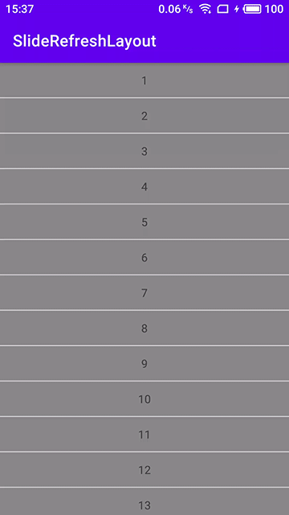
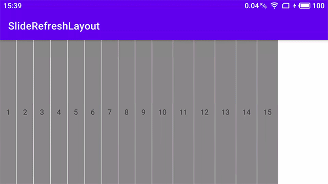

## SlideRefreshLayout
继承自ViewGroup的自定义布局，主要特点是可以在任意方向添加滑动响应视图，用来做下拉刷新和追加数据等功能非常方便，提供SlidingView接口方便扩展自己喜欢的响应视图，欢迎提供更多自定义响应视图。

### 安装
当前最新版本：[](https://jitpack.io/#cn.numeron/slide-refresh-layout)

1. 在根模块的`build.gradle`的适当位置添加以下代码：
   ```groovy
      allprojects {
        repositories {
            ...
            mavel { url 'https://jitpack.io/' }
        }
      }
   ```

2. 在模块的`build.gradle`文件中添加以下代码：
   ```groovy
      implementation("cn.numeron:slide-refresh-layout:latest_version")
   ```

### 使用
1. 实现你自己的`SlidingView`
    ```kotlin
     class SlidingTextView @JvmOverloads constructor(
        context: Context,
        attr: AttributeSet? = null,
        defStyleAttr: Int = android.R.attr.textViewStyle
    ) : AppCompatTextView(context, attr, defStyleAttr), SlidingView {

        /**
         * 当被主动滑动时调用，会调用多次
         * @param type [Type] 因滑动操作需要响应的类型，[Type.Refresh]或者[Type.Append]
         * @param threshold [Int] 响应距离的阈值
         * @param distance [Int] 总共滑动了多少距离
         */
        override fun onSliding(type: Type, threshold: Int, distance: Int) {
            text =  if (distance < threshold) "下拉刷新" else "松开刷新"
        }

        /**
         * 在复位过程中调用，会调用多次
         * @param type [Type] 因滑动操作需要响应的类型，[Type.Refresh]或者[Type.Append]
         * @param distance [Int] 移动了多少距离
         */
        override fun onRestoring(type: Type, distance: Int) = Unit

        /**
         * 在刷新或追加的操作开始时调用
         * @param type [Type] 因滑动操作需要响应的类型，[Type.Refresh]或者[Type.Append]
         */
        override fun onStartSliding(type: Type) {
            text = "正在刷新"
        }

        /**
         * 在刷新或追加的操作停止时调用
         * @param type [Type] 因滑动操作需要响应的类型，[Type.Refresh]或者[Type.Append]
         */
        override fun onFinishSliding(type: Type) = Unit

    }
    ```

2. 在`xml`中声明布局：
   ```xml
   <com.numeron.sliderefreshlayout.SlideRefreshLayout ...
        
        <Your view implements SlidingView
           android:layout_width="match_parent"
           android:layout_height="64dp"
           app:layout_direction="top"
           app:layout_slide_type="refresh"
           ... />

        <androidx.recyclerview.widget.RecyclerView
            android:layout_width="match_parent"
            android:layout_height="match_parent"
            ... />

        <Your view implements SlidingView
            android:layout_width="match_parent"
            android:layout_height="64dp"
            app:layout_direction="top"
            app:layout_slide_type="append"
            ... />

   </com.numeron.sliderefreshlayout.SlideRefreshLayout>
   ```

3. 添加监听器
    ```kotlin
        //添加刷新监听
        slideRefreshLayout.onRefreshListener = SlideRefreshLayout.OnRefreshListener {
            //do refresh
        }
        //添加追加监听
        slideRefreshLayout.onAppendListener = SlideRefreshLayout.OnAppendListener {
            //do append
        }
    ```

### 效果展示
竖向列表下滑刷新和上滑加载：


横向列表右滑刷新和左滑加载：

